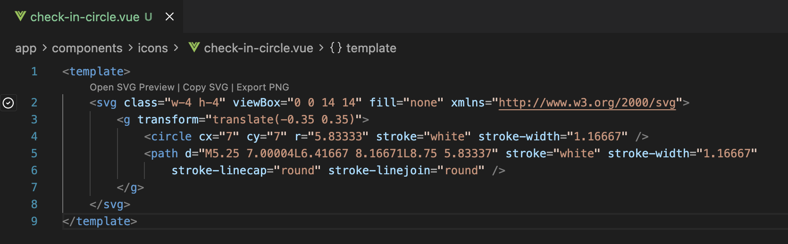
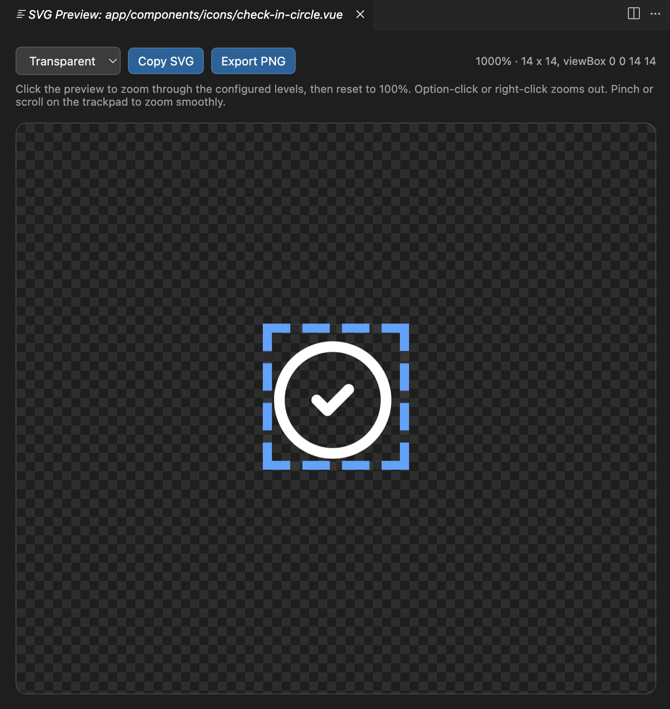

# SVG Preview for Vue

SVG Preview for Vue renders inline SVG directly inside VS Code and Cursor for `.vue`, `.html`, `.tsx`, and `.jsx` files.





## Features

- SVG thumbnails in the editor gutter with transparent backgrounds, aspect-ratio preservation, and optional borders.
- CodeLens actions above each SVG for opening a large preview, copying SVG source, and exporting PNG.
- Hover previews on SVG blocks with size, viewBox, and quick actions.
- A responsive webview preview with configurable click zoom, right-click zoom out, trackpad zoom, background selection, Copy SVG, and Export PNG.
- SVG Explorer sidebar that scans the workspace and lists every supported file containing inline SVG, with rendered thumbnails and dimensions.
- Incremental caching so open documents refresh quickly and workspace scans only re-read changed files.

## Usage

Open any supported file containing an inline `<svg>...</svg>` block. SVG Preview for Vue automatically detects every SVG and renders a thumbnail in the editor gutter.

Use the CodeLens actions above each SVG to open the large preview, copy the SVG source, or export a PNG. In the large preview, click the SVG area to zoom through `svgPreview.clickZoomLevels`, then reset directly to `100%`. Option-click or right-click zooms out, trackpad pinch/scroll gestures provide smooth zoom, and a dashed frame using `svgPreview.viewBoxBorderColor` shows the SVG viewBox bounds.

## Supported Files

- Vue single-file components: `.vue`
- HTML: `.html`
- React JSX: `.jsx`
- React TSX: `.tsx`

## Commands

- `SVG Preview: Open Preview`
- `SVG Preview: Refresh`
- `SVG Preview: Export PNG`
- `SVG Preview: Copy SVG`

## Install From VSIX

```sh
cursor --install-extension svg-preview-for-vue-1.0.0.vsix
```

In VS Code or Cursor, you can also use Extensions -> Install from VSIX.

## Settings

```json
{
  "svgPreview.previewSize": 56,
  "svgPreview.background": "transparent",
  "svgPreview.showBorder": true,
  "svgPreview.autoRefresh": true,
  "svgPreview.maxPreviewWidth": 180,
  "svgPreview.viewBoxBorderColor": "#4da3ff",
  "svgPreview.clickZoomLevels": [200, 400, 600, 800, 1000]
}
```

`svgPreview.background` supports `transparent`, `white`, and `dark`.

## Notes On Vue Syntax

SVG discovery uses an HTML parser and supports multiple SVGs, nested SVGs, regular attributes, and Vue-specific attributes such as `:class`, `:style`, `v-if`, and `v-for`. For rendering previews, Vue directives and event handlers are removed from the static preview copy because they require a Vue runtime context. The original SVG source is preserved for copy and export commands.

Tailwind-style paint classes such as `fill-black`, `fill-white`, `stroke-black`, and arbitrary colors like `fill-[#000]` are normalized for previews so SVGs still render outside the app runtime.

## Development

```sh
nvm use
npm install
npm run compile
```

Open the project in VS Code or Cursor and run `Developer: Reload Window` if the extension host is already active. Use `Run Extension` from the extension development host workflow to test the extension interactively.

## Publishing

```sh
npm run compile
npm run vsix
```

Publish with `npm run publish:marketplace` after logging in with `vsce login tasheron`.
